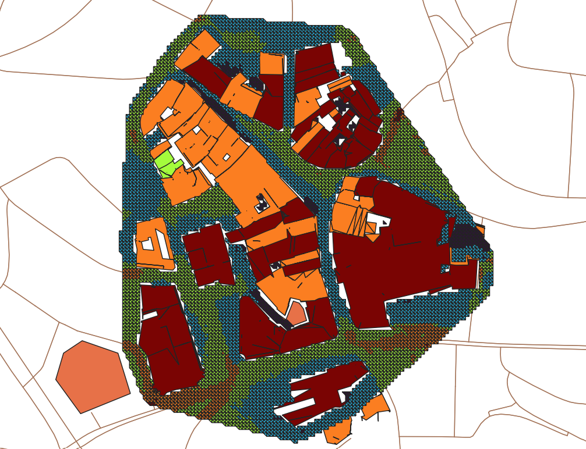
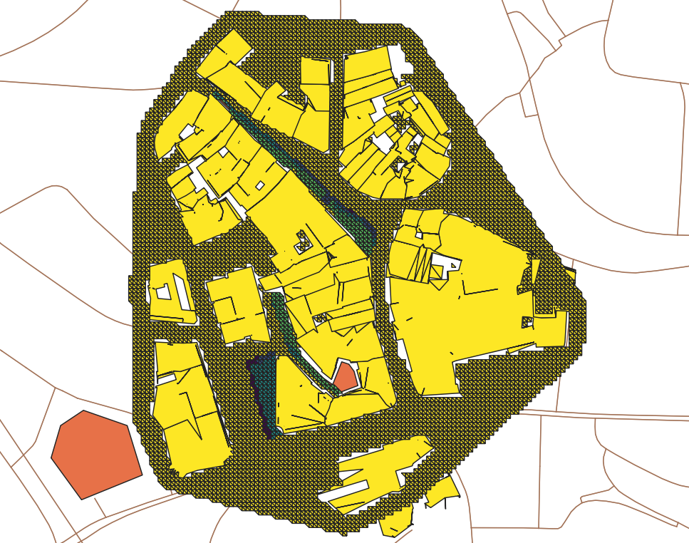

# Urban-Heat-Islands-CH
An open-source framework for the quantification of Urban Heat Islands based on Swiss open-data

## Introduction
In this project, open-source dataset are leveraged to build a framework for visualizing urban heat isaland (UHI) effect and demonstrate the application of scenarios on 1 case-study representative of the Swiss landscape, quantifying improvement measures. 

## Usage of codes
### Open-source files and import to QGIS
Choose the geographical zone (tile, canton) for the area of study. Step 1 : Download the files, Step 2 : Import them to QGIS

Swissbuildings3D : 
1. Geodatabase format from https://www.swisstopo.admin.ch/en/geodata/landscape/buildings3d3.html#download
2. Import *Floor/Roof/Wall/streets/green* layers

MO cadaster
1. GeoPackage format from https://geodienste.ch/services/av
2. Import *lcsf* layer, filter by "Genre"="batiment"

Terrain
1. XYZ file format from https://www.swisstopo.admin.ch/en/geodata/height/alti3d.html
2. Choose resolution of 2 meter or o.5 meter and read it with pandas

Alt
1. Geopackage format from https://www.swisstopo.admin.ch/de/landschaftsmodell-swisstlm3d
2. Import *tlm_bb_bodenbedeckung/tlm_strassen_strasse* layers 

Scenario1
1. Create a new layer with polygon objects representing newly added green grounds in QGIS
2. Import *Scenario1* layer 

### QGIS
Create a new GeoPackage file. Add layers with the "export features" option of QGIS (export without "fid" field), with names :
- *zone_cad* : MO features of buildings connected to DHN
- *zone_tout* : MO features of all buildings in the area of study
- *centrale* : point feature of thermal heating station coordinates
- *floor* : swissbuildings3D features of floors of all buildings in the area of study
- *wall* : swissbuildings3D features of walls of all buildings in the area of study
- *roof* : swissbuildings3D features of roofs of all buildings in the area of study
- *streets*: swisstlm 3D features of streets in the area of study
- *green*: features of green areas in the area of study
- *scenario1*: new features of scenario 1 in the area of study

### Code custom modifications
In addition to the newly created GeoPackage, a climatic and a horizon file must be provided and imported on the same directory as where the software code was cloned.

Before launching the "main_code.py" from command line, it must be custom modified for each simulation, either from a text files reading app or a python editor app such as *Spyder* or *Visual Code Studio*.
Each modification is signaled with *#TODO*.
- gpkg_filepath = r"---.gpkg" : File path of the GeoPackage containing all necessary layers
- create_geometry_3D = True/False (default = False) : Activates the simulation with thermal envelope from Swissbuildings3D geometries (much longer simulation)
- calculate_volume_3D = True/False (default = False) : Activates the volume calculation from Swissbuildings3D geometries
- citysim_filepath = r"---/CitySim.exe" : File path of the CitySim solver
- directory_path = r"---" : Name of the new directory to be created by the simulation
- climate_file = r"---.cli" : File path of the climate file
- horizon_file = r"---.hor" : File path of the horizon file

### Python libraries
The required libraries to import are listed in the *requirements.txt* file

### Results
The resulted .xml file is under the directory path defined in "main_code"
And resulted temperature layers could be found with prefix "All_AST" in the .gpkg file used

## Bakcground
Olivier Chavanne established a framework to process and analyze information of all buildings in the area of study and simulate the surface temperature of those buildings through Citysim. To measuring the effect of UHI, the effect of different kinds of grounds, e.g. asphalt road, concrete road, green areas, around buildings need to be added on existent framework. 
## Grounds
XYZ contains coordinates information of a square lattice. To put it in to use of heat computing, triangulization is done on it, i.e. dividing everyone small squares of the lattices into two triangles along the diagonal line. 
### Types
Asphald ground represents roads covered by asphalt 
Concrete ground represents roads covered by concrete
Green grounds represents grounds that's green like grass, bushes and trees in total

### Physical attributions
Here I list the attributons of different types of grounds that matters for 
Kfactor represents how saturated the ground is.
Shortwaverefletance represents the ability to reflect solar energy and if the grounds is darker, it is smaller.

| Ground type | Kfactor | Shortwaverefletance |
|----------|----------|----------|
| Asphalt | 0.1 | 0.14 |
| Concrete | 0.1 | 0.35 |
| Green | 0.7 | 0.22 |

[Sources](#Reference)

## Functions of code for processing ground data
Functions below are added to xml.py
add_ground_from_XYZ: 
1. Triangulize ground 
2. Discard grounds under buildings
3. Create a geodataframe that contains all traiangles objects and assign all grounds the type of concrete road

modify_type:
1. Find grounds of road and green area through intersection with streets and green area objects
2. Modify the type of concrete ground to type of asphalt ground or green area and attach physical characteristics like Kfactor and short wave reflectance acoordingly 

cut: 
Discard grounds and buildings that's distant from my area of study to save computing time

AST:
1. Calculate average surface temperature of each building and atribute them to corresponding building according to surface_id
2. Attribute temperature of each ground triangle according to gid 

## Simulation 
### Case
The case is a neighbourhood around fountaine de la Justice, Lausanne with dense buildings and roads roads network. While pavements is concrete road, streets are asphalt roads. And there is no green grounds in this area. So I add green grounds to see if it mitigate the UHI effect.

The 3D model is simulated in CitySim pro.

Run case-study with XYZ file of resolution being 2 meter, meteorological data for contemporary, 2030, 2040 and 2050, visualise reseulted temperature data in QGIS. All relevant images can be found under folder *image*. A sample is shown below with blue reresenting low temperature, read representing high temperature:

1. The defalut case study at 2050
<!--  -->

2. Add green areas to it
<!--  -->

The scale of two images above is 

3. Magnitude of decreased temperature after adding green areas
<!--  -->

With scale below

## Conclusion
In this project, open source datasets are obtained for different types of grounds. And based on them, mesh of grounds are created, and different ground surfaces are attributed right type and respective physical characteristics. The resulted .xml file is run the case of Lausanne and visualised in CitySim Pro.

One scenario, i.e. substituting original grounds of certain areas with green grounds, is demonstrated and its effects on urban heat islands is visualised in QGIS. 

## Prospect
1. Develop an algorithm that can create adaptive mesh of grounds, i.e. finer mesh at sharp part of geometry objects.
2. Add trees into our framework and study their effects on UHI
3. Add water into framework and study their effects on UHI

## Reference
1. Upadhyay, G ; Kämpf, J; Scartezzini, J: Ground temperature modeling: The case study of Rue des Maraîchers in Geneva, 2014, URL: https://infoscience.epfl.ch/record/198754?ln=fr
2. https://github.com/kaemco/CitySim-Solver/wiki/The-district#groundsurface

